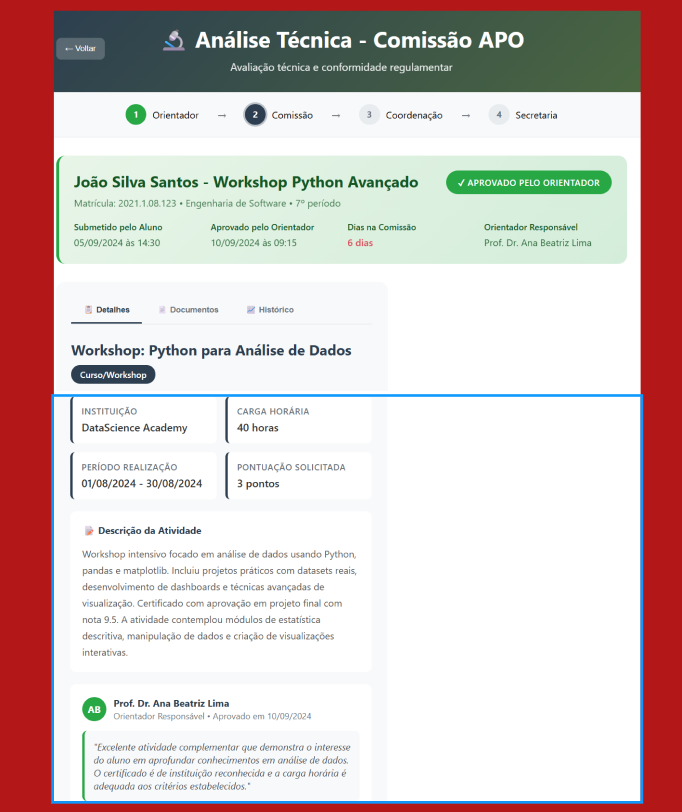

## 2. Análise Técnica - Comissão APO

**Legenda:** Etapa de análise técnica feita pela Comissão APO.

**Como o usuário interage:**  
- Visualiza os detalhes do curso ou atividade enviada.  
- Acompanha o parecer do orientador e o tempo de análise pela comissão.  
- Pode consultar os documentos anexados e o histórico de avaliação.  

---