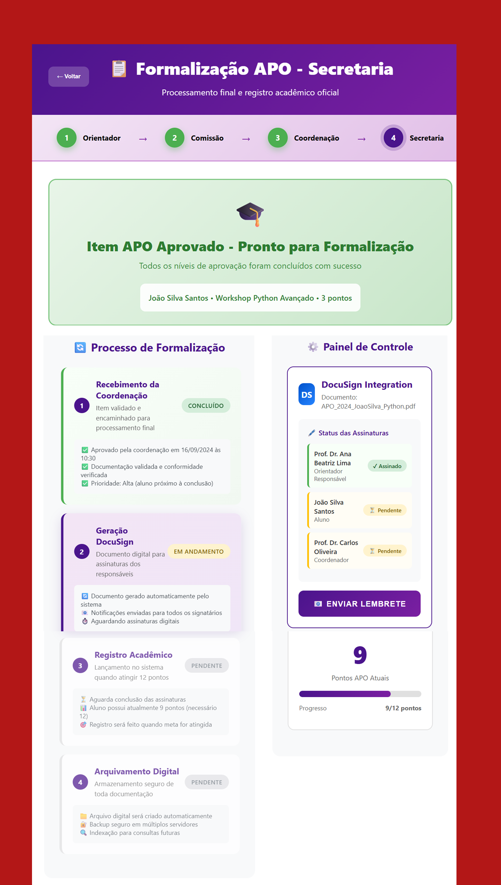

## 1. Formalização APO - Secretaria

**Legenda:** Tela onde o item APO é processado para registro acadêmico oficial.

**Como o usuário interage:**  
- Visualiza o status do processo de formalização.  
- Acompanha o progresso de cada etapa (Coordenação, Geração de Documento, Registro Acadêmico e Arquivamento Digital).  
- No painel lateral, pode verificar as assinaturas pendentes e enviar lembretes.  

---
