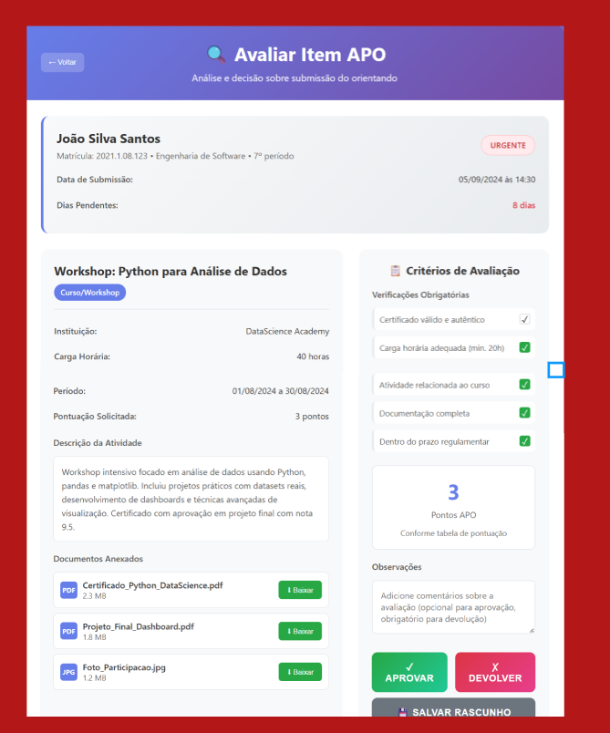

# Caso de Uso - Avaliar Item APO (Orientador)

Nesta tela, o **orientador** analisa a submissão de APO enviada pelo aluno.  

A tela apresenta:  
- **Dados do aluno** (nome, matrícula, curso, período).  
- **Detalhes da atividade** (instituição, carga horária, período, pontos solicitados, descrição).  
- **Documentos anexados** pelo aluno para validação.  
- **Critérios de avaliação** obrigatórios que devem ser marcados conforme a análise.  
- Campo de **observações** para comentários adicionais.  

Ao final, o orientador pode escolher entre:  
- **Aprovar** o item.  
- **Devolver** para correções/ajustes.  
- **Salvar como rascunho** caso ainda não queira tomar uma decisão final.
