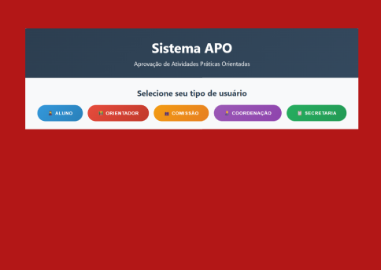

# Tela Inicial - Seleção de Usuário

Nesta tela, o usuário acessa o **Sistema APO** e deve selecionar o seu tipo de perfil para prosseguir:  
- **Aluno**  
- **Orientador**  
- **Comissão**  
- **Coordenação**  
- **Secretaria**

A interação acontece através dos botões coloridos. Ao clicar em um deles, o sistema redireciona o usuário para o painel correspondente ao seu perfil.