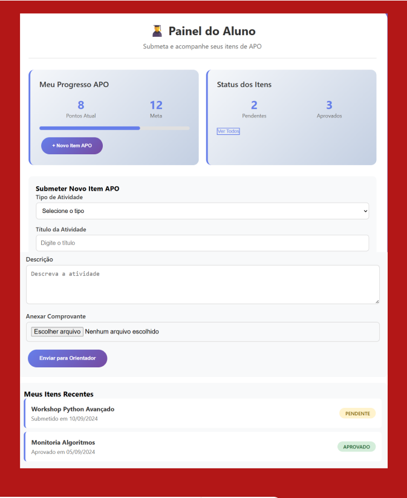

# Caso de Uso - Submeter Item APO (Aluno)

Nesta tela, o aluno acompanha o seu progresso em pontos APO e a situação dos itens já enviados (pendentes ou aprovados).  

Para **submeter um novo item APO**, o aluno deve:  
1. Selecionar o **tipo de atividade** no menu suspenso.  
2. Informar o **título da atividade**.  
3. Escrever uma **descrição detalhada da atividade**.  
4. Anexar o **comprovante** correspondente (certificado, declaração, etc).  
5. Clicar em **Enviar para Orientador**.  

Na parte inferior, o aluno também visualiza seus itens mais recentes e o status de cada um (pendente ou aprovado).